# Top 28 Best Transcription Software in 2025

Stuck manually typing out hours of audio while your deadlines keep piling up? Whether you're transcribing interviews for research, adding captions to social media videos, generating subtitles for international audiences, or just trying to make sense of meeting recordings, the right transcription tool transforms tedious work into a quick click. Modern speech-to-text platforms deliver accuracy rates above 95%, support dozens of languages, and often include features like automatic speaker identification and real-time collaboration that make the whole process feel less like work and more like magic.

## **[Happy Scribe](https://www.happyscribe.com/)**

AI-powered transcription and subtitle platform serving 6 million users with human-reviewed accuracy options in 120+ languages.

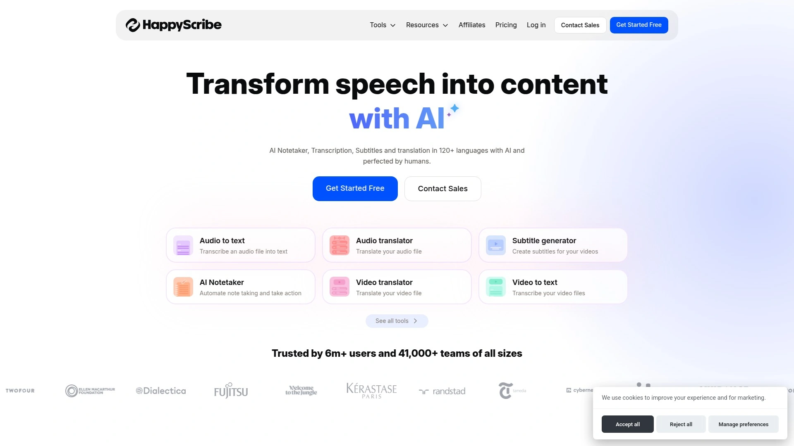

Happy Scribe gives you choices that matter—instant automated transcription when speed counts, or expert-reviewed human transcription hitting 99% accuracy when quality can't be compromised. The platform handles both scenarios beautifully, with automatic transcription available in 120+ languages and professional linguists covering 70+ languages for human-made work. Upload video or audio files of any length and watch the transcripts appear with automatic speaker identification, timestamps, and collaborative editing tools that let teams work together in real-time. The built-in editor makes polishing results seamless, offering verbatim options, custom glossaries, and style guides that ensure consistency across projects. Export flexibility covers every need—download as Word, PDF, SRT, VTT, or TXT files, then share via unique links with view-only or edit permissions. Integration with YouTube, Vimeo, Google Drive, and Zapier keeps workflows smooth, while GDPR compliance and SOC 2 Type 2 certification protect sensitive content. The free manual transcription editor includes smart shortcuts, auto-loop playback, and automatic timestamp insertion for anyone preferring hands-on control. Happy Scribe's Ask AI feature summarizes transcripts and generates blog articles from recordings, extending value beyond basic transcription.

## **[Otter.ai](https://otter.ai)**

Real-time meeting transcription specialist with AI-powered note-taking that captures live conversations across Zoom, Google Meet, and Microsoft Teams.

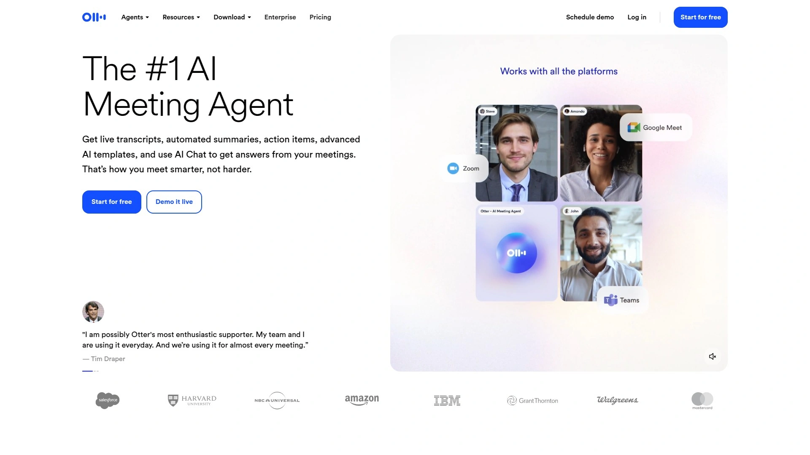

Otter excels at meeting scenarios where transcription needs to happen as people talk, joining video calls automatically and generating live notes with speaker recognition. The platform delivers 85-95% accuracy depending on audio quality, with custom vocabulary features improving results for industry jargon and technical terms. Meeting participants can highlight key moments, add comments, and assign action items directly within transcripts while conversations continue. Integrations with Slack, Dropbox, Microsoft, and Google services keep transcripts flowing into existing workflows without extra steps. Free plans support basic transcription with limited monthly minutes, while Pro plans starting at $16.99 monthly unlock extended transcription time and advanced collaboration features. The mobile apps for Android and iOS make it possible to record and transcribe anywhere, though the platform currently focuses on US and UK English only.

## **[Rev.com](https://www.rev.com)**

Human transcription leader offering both AI-generated drafts and professional human transcriptionists with industry-leading turnaround times.

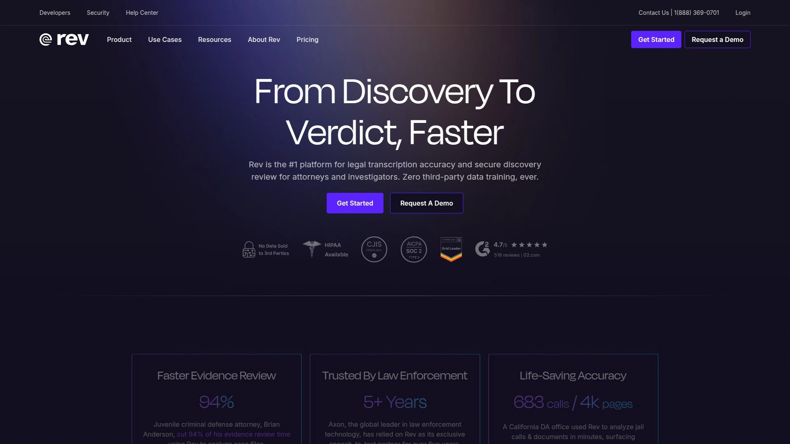

Rev combines automated transcription starting at $0.25 per minute with human transcription services delivering high accuracy when AI alone won't cut it. Professional transcriptionists typically complete projects within 12 hours, providing that crucial human touch for complex audio with multiple speakers, heavy accents, or technical terminology. The platform supports 37 languages for AI transcription and offers caption and subtitle services alongside standard text transcripts. Rev's straightforward pricing at roughly $15 per hour makes budgeting simple, without surprise fees or confusing subscription tiers. Audio quality matters less here than with pure AI solutions—human transcribers handle background noise, poor recordings, and overlapping speech that break automated systems.

## **[Descript](https://www.descript.com)**

All-in-one audio and video editing platform with text-based editing that lets you cut recordings by deleting words from transcripts.

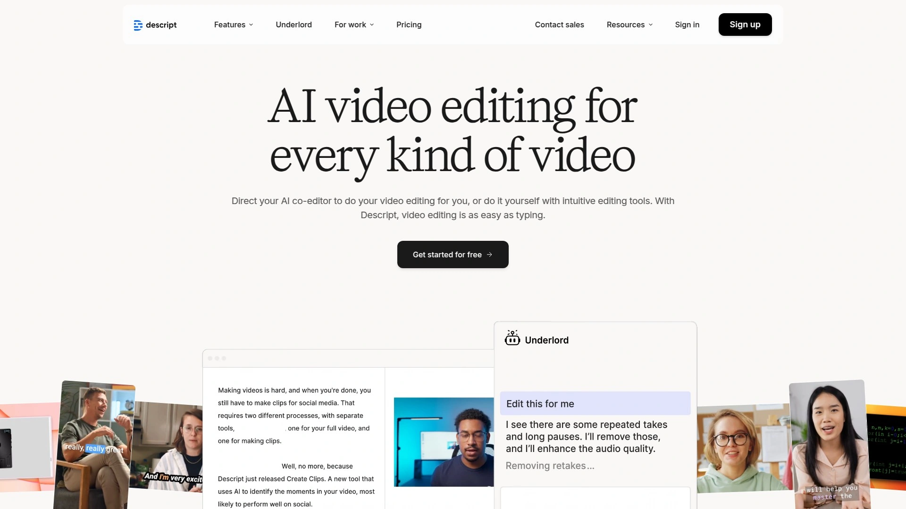

Descript transcribes automatically with 95% accuracy, then transforms transcription into a complete editing workflow where editing text edits the actual audio or video. Remove filler words across an entire recording with one click, create podcast episodes by rearranging transcript paragraphs, or fix mistakes by typing corrections that automatically adjust the audio. The platform includes screen recording, remote recording capabilities, overdubbing technology, and studio sound processing that upgrades audio quality. White Glove human transcription service costs $2 per minute for projects requiring near-perfect accuracy, though the 2-hour length limit and premium pricing make this best for shorter critical content. Pricing starts at $15-19 monthly for Creator plans, with Pro plans at $30 monthly offering expanded features for serious podcasters and video creators. Integration with platforms like Riverside, SquadCast, YouTube, and Slack streamlines publishing workflows.

## **[Sonix](https://sonix.ai)**

Premium AI transcription platform delivering up to 99% accuracy across 49+ languages with advanced analysis tools including sentiment detection and thematic analysis.

Sonix stands out for accuracy that rivals human transcription while maintaining AI speed—transcripts arrive in minutes regardless of recording length thanks to parallel processing that handles sections simultaneously. The platform goes beyond basic transcription with AI-powered summarization that condenses hours into digestible highlights, automatic chapter creation for easy navigation, and topic detection that timestamps when specific subjects appear. Sentiment analysis evaluates emotional tone throughout conversations, while entity detection automatically finds and timestamps mentions of people, places, and important information. Natural language processing handles complex terminology, diverse accents, and speaker differentiation with consistency that reduces manual correction time. Pricing starts at $10 per hour with subscription options lowering costs to $5 per hour for regular users. Enterprise-grade security and extensive API options make Sonix suitable for organizations processing large transcript volumes.

## **[Trint](https://trint.com)**

Journalist-focused transcription tool with collaborative editing features designed specifically for news outlets, researchers, and content creators.

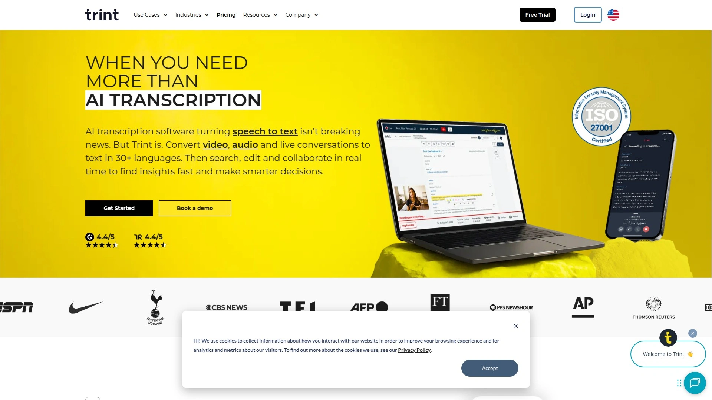

Trint targets professional environments where multiple team members need to search, highlight, and share specific transcript sections during fast-paced production cycles. The AI transcription editor delivers high accuracy with unique features allowing users to edit video and audio by editing text, making it particularly useful for broadcast and documentary workflows. Pricing starts at $80 monthly for 7 transcriptions, positioning Trint as a premium option for organizations rather than individual creators. The platform emphasizes collaboration tools and searchability that help research teams quickly locate quotes and clips across large transcript libraries.

## **[Notta](https://www.notta.ai)**

Free-tier friendly transcription platform reaching 98% accuracy in 58 languages with seamless sync across desktop and mobile devices.

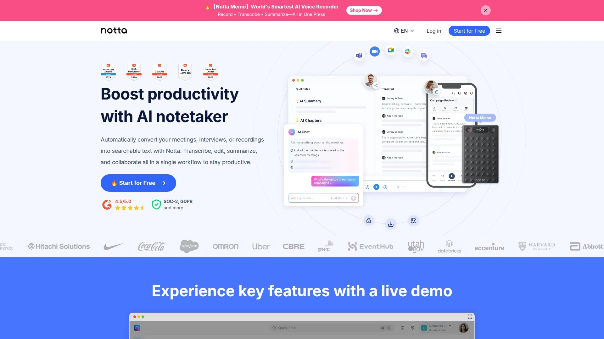

Notta makes transcription accessible with generous free allowances and user-friendly apps for every device—Mac, Windows, iPhone, iPad, and Android tablets all sync automatically. Upload files directly or paste links from YouTube, Google Drive, and Dropbox to transcribe content without downloading first, with support for 10+ audio and video formats including WAV, MP3, MP4, and AVI. Real-time transcription joins live meetings from Zoom, Google Meet, Webex, and Microsoft Teams, generating transcripts as conversations happen. AI summary templates condense lengthy transcripts into actionable insights with custom prompts, while one-click translation converts finished transcripts into 40+ languages. Speaker identification automatically labels who said what, and export options include MP3, TXT, SRT, PDF, DOCX, and XLSX formats. Security compliance covers SSL, GDPR, APPI, and CCPA standards with encryption through AWS services. The Chrome extension captures transcripts without switching tools or leaving the browser.

## **[TranscribeMe](https://www.transcribeme.com)**

Hybrid transcription service combining AI automation with human refinement for enhanced accuracy across 14 languages.

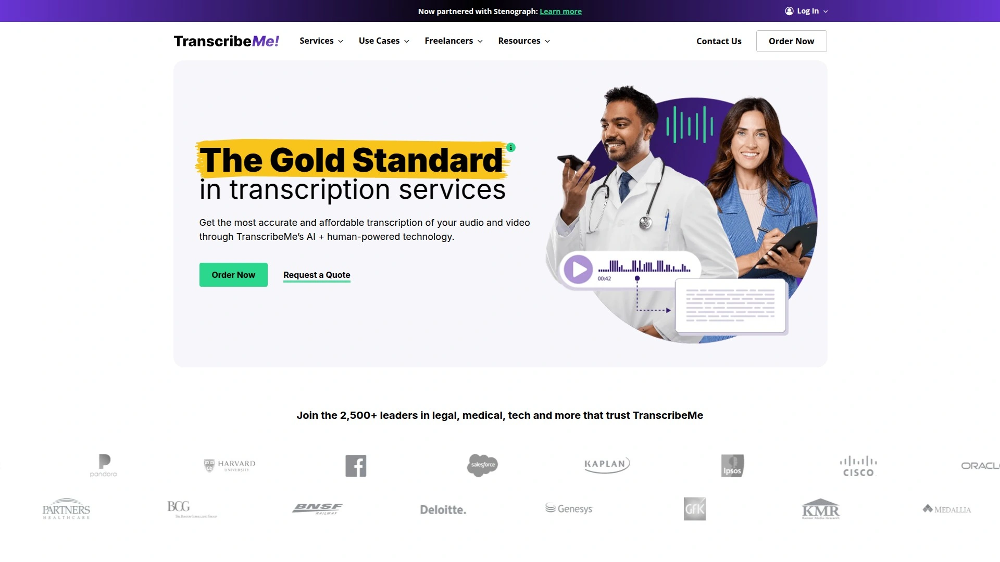

TranscribeMe offers machine transcription in 9 languages with optional human review expanding language support to 14 total. The four-step human transcription process involves certified transcribers working under NDAs to ensure accuracy and confidentiality. Starting at $0.07 per minute or roughly $4.20 per hour, TranscribeMe provides budget-friendly options though turnaround times for human-reviewed work typically exceed pure AI services. The platform works well for users needing higher accuracy than AI alone provides without paying premium per-minute rates.

## **[Scribie](https://scribie.com)**

Specialized human transcription service focusing exclusively on English with certified transcribers delivering exceptional accuracy.

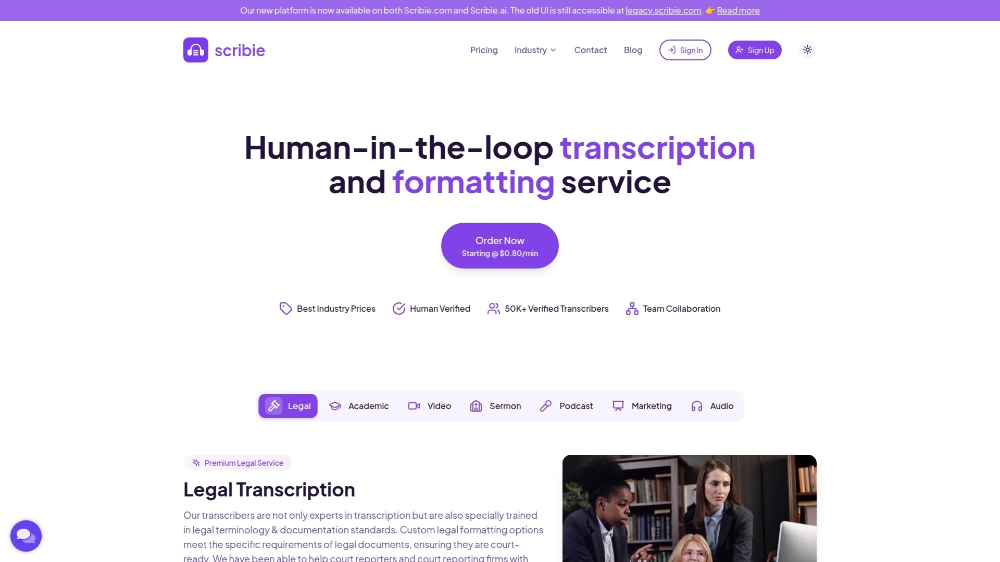

Scribie takes a human-first approach with transcripts generated through multiple quality control steps involving certified transcribers who sign NDAs before accessing content. This English-only focus allows Scribie to maintain consistently high accuracy with pricing starting at $0.80 per minute or $48 per hour. Audio time coding provides precise timestamp markers throughout transcripts, making Scribie particularly useful for legal, academic, and research applications requiring verbatim documentation. The trade-off for accuracy is speed—human transcription inherently takes longer than AI alternatives, though Scribie's process ensures fewer errors requiring correction.

## **[GoTranscript](https://gotranscript.com)**

Human-powered transcription platform supporting 40+ languages with turnaround times between 6-12 hours.

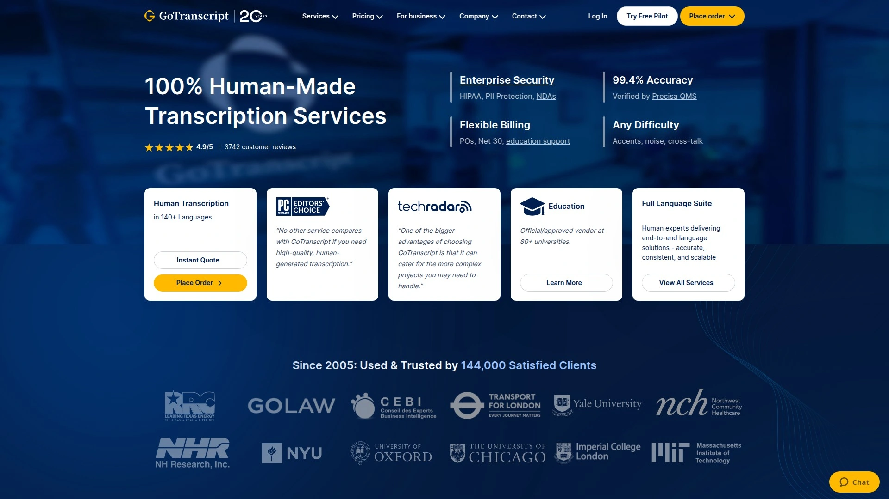

GoTranscript emphasizes human transcription quality over automation, delivering transcripts in 6-12 hours across 40+ language options. The platform includes AI transcription capabilities as an add-on, but the core service focuses on professional transcribers handling difficult audio that breaks automated systems. Clear transcription guidelines and a user-friendly transcription tool make the platform accessible for clients new to outsourcing transcription work. Pricing reflects the human labor involved, positioning GoTranscript between budget AI services and premium white-glove offerings.

## **[VEED.io](https://veed.io)**

All-in-one video editor with automatic subtitle generation in 100+ languages and extensive style customization options.

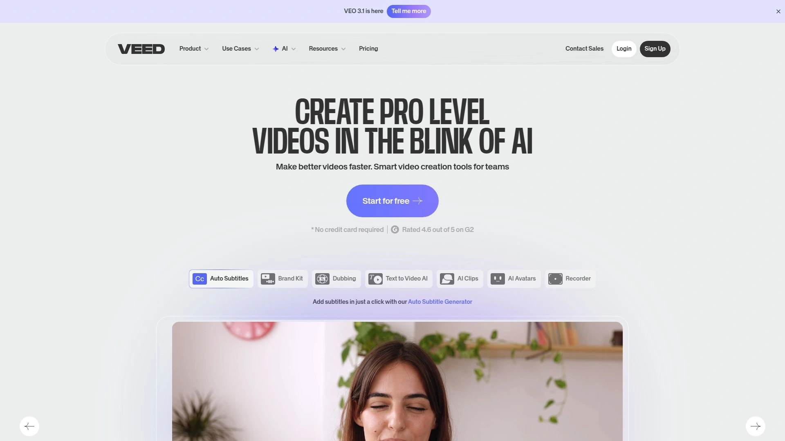

VEED combines video editing tools with 99.9% accurate auto-captioning, letting creators add subtitles while trimming clips, adding music, and applying visual effects in one platform. Auto-translation converts subtitles into multiple languages with a few clicks, expanding content reach to global audiences without separate translation tools. Style customization includes dozens of fonts, colors, background animations, and preset templates matching trending caption styles from popular creators. The free plan offers 10 minutes of monthly usage, while paid plans starting at $12 monthly unlock unlimited exports and premium editing features. Smart speaker detection identifies different voices automatically, and export options include SRT, VTT, and TXT subtitle files for use on other platforms. VEED works entirely in the browser without software downloads, making it accessible from any device with internet connection.

## **[Kapwing](https://www.kapwing.com)**

Social media-focused video editor with AI subtitle generator delivering 99% accuracy optimized for short-form content creation.

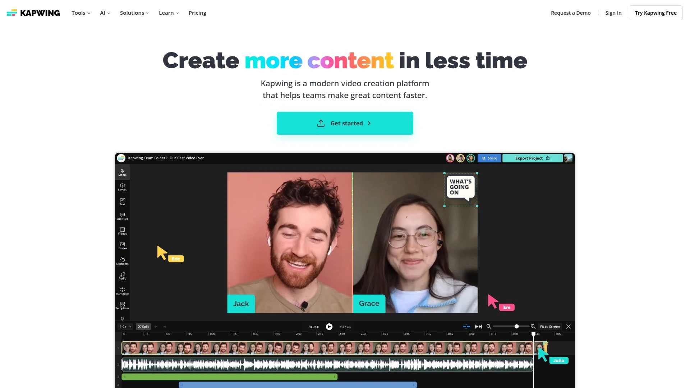

Kapwing targets content creators making videos for TikTok, Instagram Reels, and YouTube Shorts with automatic subtitle generation that enhances engagement and watch time. The platform generates word-by-word subtitles with fully editable transcripts in seconds, allowing quick adjustments before exporting finished videos. Built-in video editing tools handle trimming, resizing for different platforms, and adding music or effects alongside subtitle creation. Export options include standalone SRT files for uploading to YouTube or other platforms, plus the ability to burn subtitles permanently into video for platforms without caption support. Kapwing emphasizes speed and simplicity over advanced features, helping creators publish content quickly without steep learning curves.

## **[Maestra](https://maestra.ai)**

Comprehensive transcription platform supporting 125+ languages with live real-time transcription and advanced translation features.

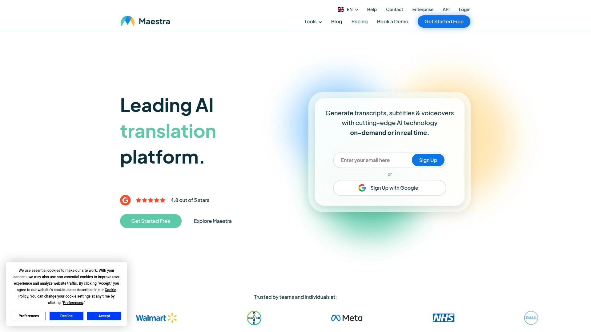

Maestra addresses the language limitations of competing tools with support for 125+ languages and exceptional accuracy across diverse audio types. Real-time transcription converts speech to text as it happens during live events, presentations, or meetings without requiring pre-recorded files. Beyond transcription, Maestra includes translation, voiceover generation, and subtitle creation in a single platform that handles complete localization workflows. The breadth of features makes Maestra particularly valuable for international organizations and content creators serving global audiences. AI-powered tools extend beyond basic transcription to content analysis and automated post-production tasks.

## **[Transkriptor](https://transkriptor.com)**

AI note-taking and transcription tool with mobile-first design delivering quick transcripts for meetings and interviews.

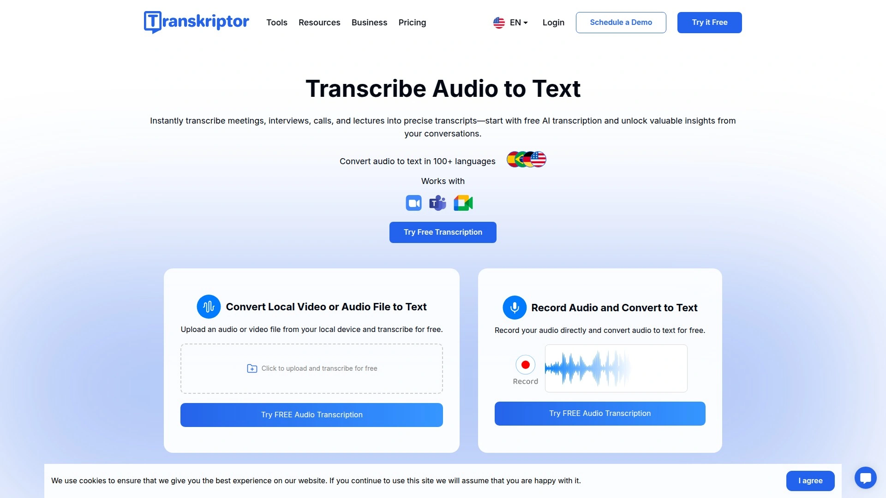

Transkriptor focuses on simplicity and speed, converting audio to text through streamlined workflows optimized for busy professionals. Mobile apps make it easy to record and transcribe on the go, with automatic syncing ensuring transcripts appear across all devices. The platform competes directly with tools like Notta and Otter but emphasizes faster processing times and cleaner interfaces. Pricing structures accommodate individual users and small teams without forcing annual commitments or expensive enterprise minimums.

## **[Fireflies.ai](https://fireflies.ai)**

AI meeting assistant automatically joining video calls to transcribe, summarize, and analyze conversations with searchable insights.

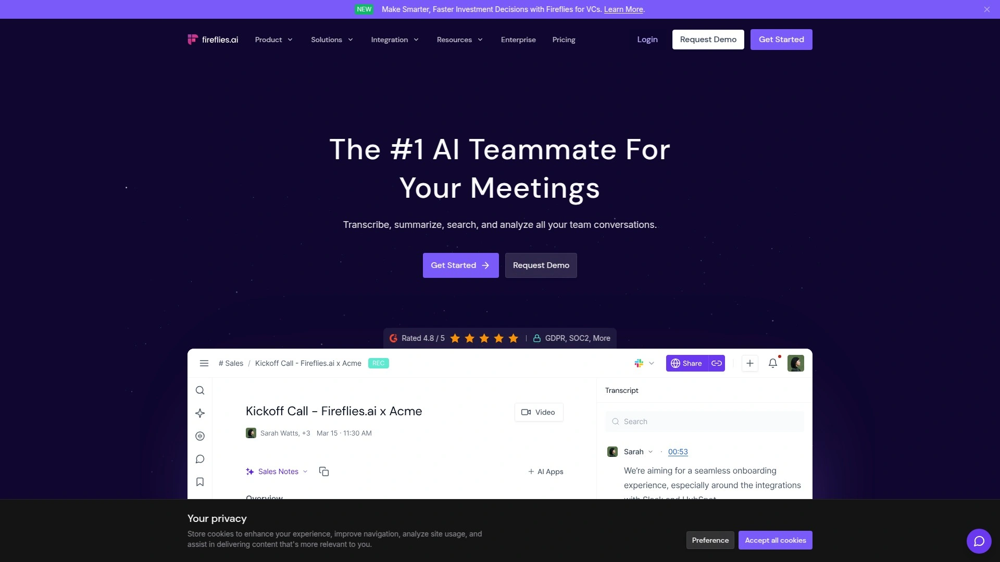

Fireflies operates as an AI teammate that sits in meetings, capturing everything said while human participants focus on discussions rather than note-taking. The platform integrates with all major video conferencing tools, joining calls automatically when scheduled and delivering transcripts immediately after meetings end. Conversation analysis tools identify action items, track speaking time distribution, and surface key topics discussed across multiple meetings. Searchable transcript libraries let teams quickly find specific moments from past conversations by searching keywords or phrases. Pricing starts at $18 monthly with free tiers available for testing basic functionality. Team collaboration features allow sharing transcript highlights and creating video clips from important conversation moments.

## **[MeetGeek](https://meetgeek.ai)**

Automated meeting transcription and note-taking platform with AI summaries and analytics tracking meeting productivity.

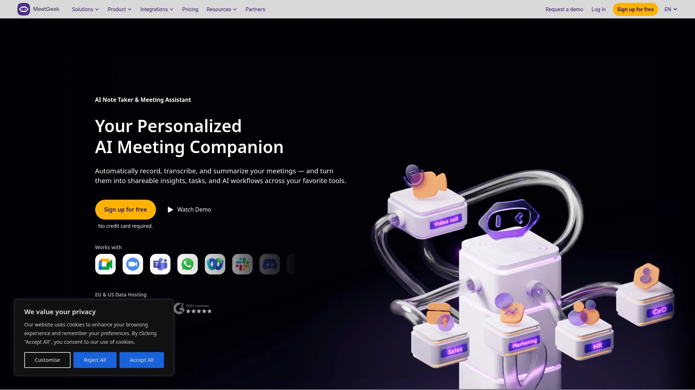

MeetGeek automates the entire meeting documentation process from recording through summary generation and action item extraction. Freemium pricing makes the platform accessible for individuals and small teams starting to explore automated meeting transcription. Analytics features track meeting patterns, speaking ratios, and engagement metrics that help teams improve meeting effectiveness over time. Integration capabilities connect MeetGeek outputs with project management and communication tools teams already use.

## **[Riverside](https://riverside.com)**

Professional recording studio platform with automatic transcription and subtitle generation built into the production workflow.

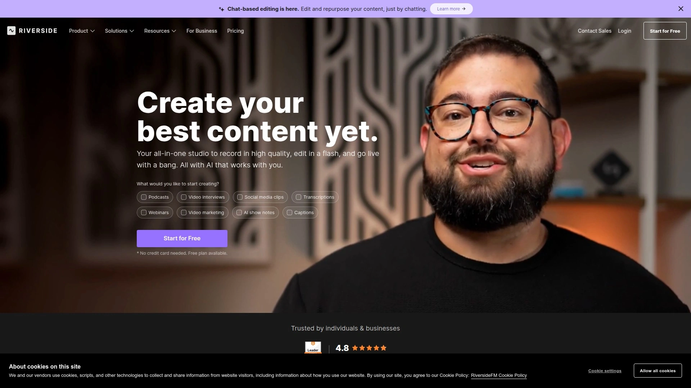

Riverside records video and audio locally on each participant's device for studio-quality results, then automatically transcribes recordings when sessions end. Transcripts appear within moments of finishing recording, downloadable immediately in SRT or TXT formats without waiting for processing. Text-based editing lets creators cut and arrange recordings by editing the transcript, removing sections by deleting words rather than manipulating audio waveforms. The integrated workflow means podcasters and video producers record, transcribe, edit, and export all within one platform instead of juggling multiple tools. Subtitle styling options and burned-in caption features prepare content for social media distribution.

## **[Amberscript](https://www.amberscript.com)**

European transcription platform offering AI and manual transcription with GDPR and ISO certifications for secure file handling.

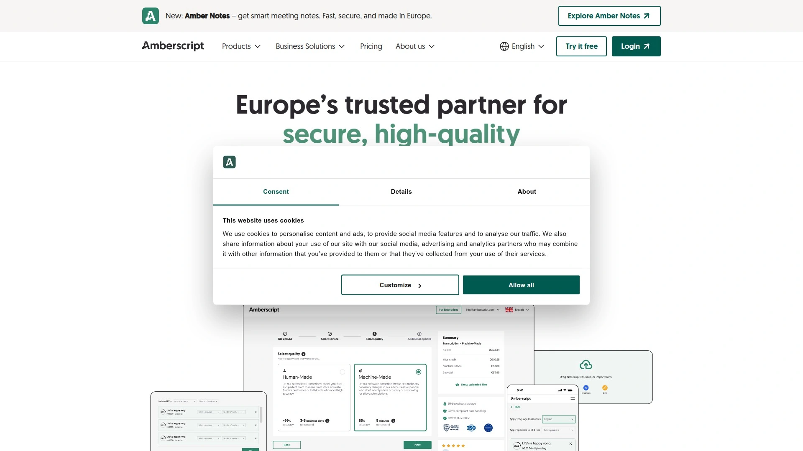

Amberscript provides machine transcription in 70 languages with professional human transcription available in 18 languages when accuracy requirements justify the cost difference. AI transcription completes in minutes at budget-friendly rates, while human transcription delivers up to 100% accuracy with 24-hour rush order options available. Native speakers perform quality checks on human transcripts, and all files remain confidentially stored in GDPR-compliant, ISO27001 and ISO9001 certified environments. The seamless online editor makes correcting AI-generated transcripts straightforward before finalizing and exporting. Video transcription support handles both audio-only files and video content with equal proficiency.

## **[Speak AI](https://speakai.co)**

Research-focused transcription and analysis platform with qualitative data analysis tools for extracting insights from interviews.

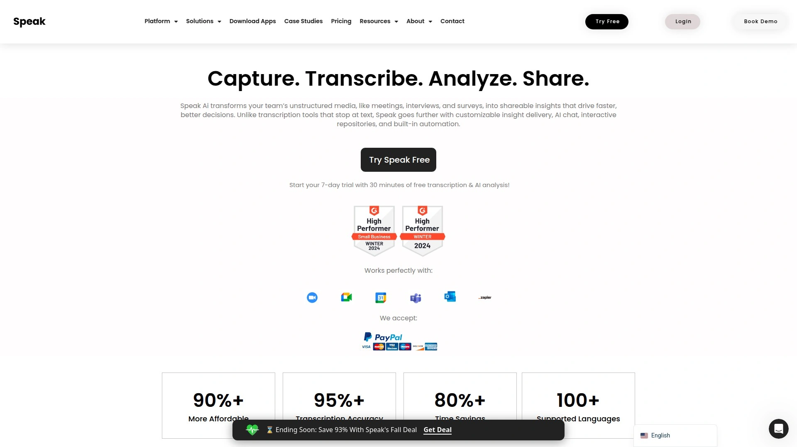

Speak AI combines transcription with analysis features designed for researchers, consultants, and organizations conducting qualitative research at scale. The platform goes beyond creating transcripts to identifying themes, coding responses, and generating insights from interview data. Multi-language support helps international research teams process content in various languages while maintaining consistent analysis frameworks. Integration capabilities connect transcription outputs with research databases and reporting tools.

## **[Reduct.Video](https://reduct.video)**

Video-first transcription tool with highlight reels and collaborative editing designed for UX researchers and product teams.

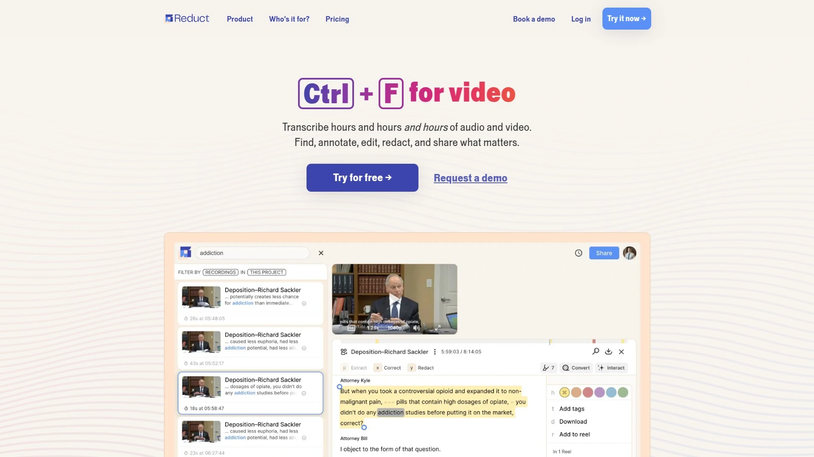

Reduct turns transcribed videos into searchable, shareable libraries where teams can create highlight reels by selecting transcript sections. The edit mode functions like Google Docs with integrated audio controls, making transcript corrections fast without constantly reaching for the mouse. Re-transcribe features process just the sections needing fixes, often improving accuracy by focusing on smaller audio chunks. Most transcriptions complete within 3-5 minutes regardless of video length thanks to parallel processing breaking files into simultaneously processed sections. Free trials offer 5 hours of video processing to test the full platform including transcription, editing, and collaboration features. Self-hosted transcription models within Google Cloud Platform infrastructure ensure data remains secure without third-party processing.

## **[Simon Says](https://simonsaysai.com)**

Professional subtitle editor with visual subtitle card system designed for broadcast-standard caption creation.

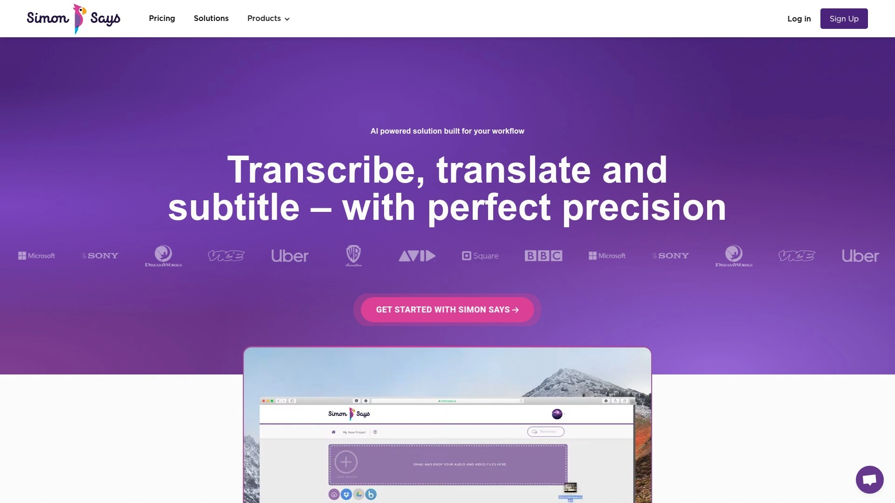

Simon Says specializes in subtitle creation with CEA-608 and 708 compliance for broadcast standards, making it suitable for television and professional video production. The visual subtitle editor displays transcripts as individual subtitle cards with predetermined start and end times based on word boundaries. Editors create new subtitle cards by pressing enter or combine cards using backspace, offering granular control over caption timing and display. Keyboard shortcuts speed subtitle editing workflows, and automatic background saving prevents lost work. Export options include standard SRT formats plus burned-in subtitle options that permanently embed captions onto video—essential for platforms like Instagram that lack caption toggle features. Integration with editing software and cloud storage platforms streamlines subtitle delivery to clients and publishing systems.

## **[Gling AI](https://gling.ai)**

YouTube-focused AI editor with multilingual audio-to-text transcription supporting content creators across languages.

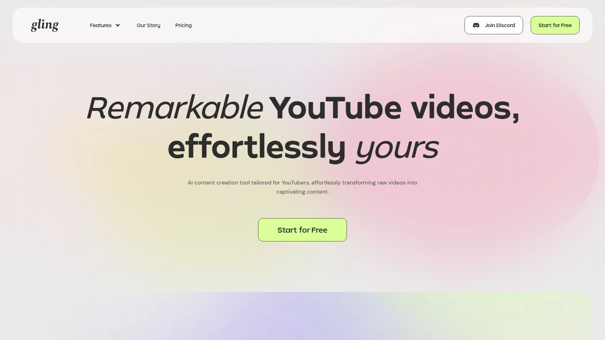

Gling AI delivers fast accurate transcription in seconds with multilingual support that doesn't require extra plugins or configuration. The platform emphasizes ease of use with no learning curve—professionals from any industry can start transcribing immediately without training. Pricing tiers accommodate different usage levels from 1 hour monthly for beginners exploring the tool to 30 hours monthly for power users with premium support. Unlimited video export with paid plans removes watermarks and enables professional distribution. Beyond transcription, Gling includes video editing features that automatically remove silence and improve pacing.

## **[Exemplary AI](https://exemplary.ai)**

AI transcription service with content generation features creating summaries, social posts, and articles from transcripts.

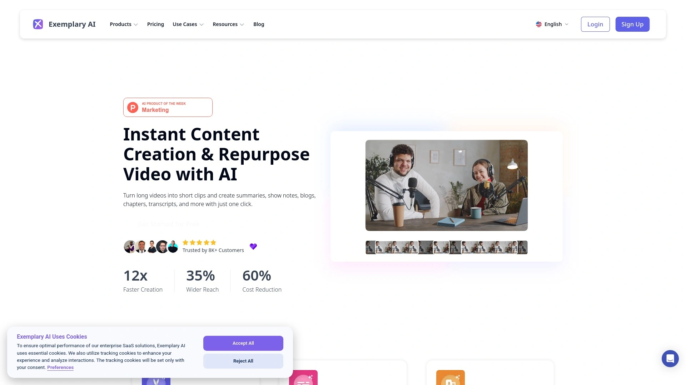

Exemplary transforms transcription into complete content workflows, generating not just text transcripts but derivative content like blog articles, social media posts, and summaries. The platform handles audio and video files with ease, delivering accurate transcriptions quickly while maintaining competitive pricing. Multi-format output options prepare content for various distribution channels without manual reformatting. Teams benefit from collaboration features and workspace organization tools that manage transcript libraries.

## **[Subly](https://www.getsubly.com)**

AI-powered accessibility platform specializing in pre-recorded video with automatic subtitle generation in 30+ languages.

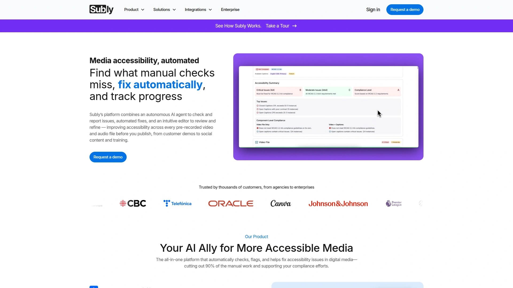

Subly focuses on making video content accessible with highly accurate automatic subtitles and captions in over 30 languages and dialects. Professional transcribers create 99% accurate subtitles when AI accuracy isn't sufficient for specialized content or complex audio situations. The platform detects and fixes accessibility issues beyond captions including color contrast problems and audio description needs. Subtitle translation tools help content creators reach global audiences by converting captions into multiple languages efficiently. Organizations needing comprehensive accessibility compliance find Subly's complete platform approach more efficient than assembling separate tools.

## **[Submagic](https://submagic.co)**

Viral video specialist with animated captions, automatic B-roll insertion, and trending subtitle styles for social media creators.

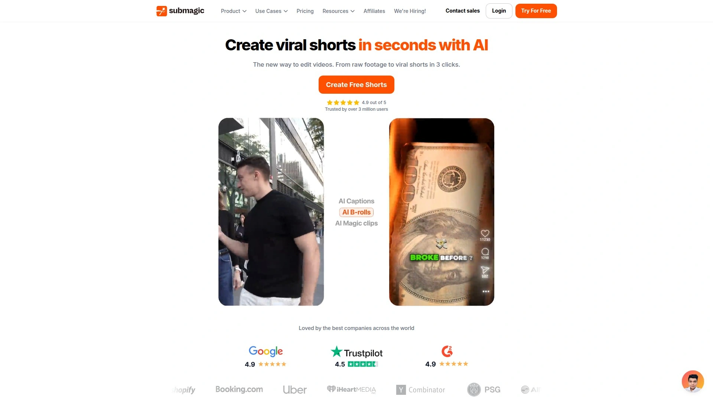

Submagic creates captivating short-form content with AI-generated captions featuring animations, emojis, and viral styling inspired by popular creators like MrBeast and Alex Hormozi. The platform transcribes videos in 50+ languages with exceptional accuracy minimizing manual typo corrections. Smart dictionary features train the AI to correctly spell niche terminology and brand names, improving transcription quality for specialized content. Beyond subtitles, Submagic adds automatic B-roll footage, smooth transitions, dynamic zooms, and sound effects that transform raw videos into polished social media content. Export options include green screen capability for After Effects and Premiere Pro workflows plus downloadable SRT, VTT, and TXT subtitle files. Multi-language translation demolishes language barriers by automatically converting captions into different languages. The three-step workflow—upload, edit styling, and export—lets creators produce engaging subtitled videos quickly without extensive editing knowledge.

## **[Zubtitle](https://zubtitle.com)**

Simple subtitle tool automatically transcribing speech and converting it to video captions with straightforward editing.

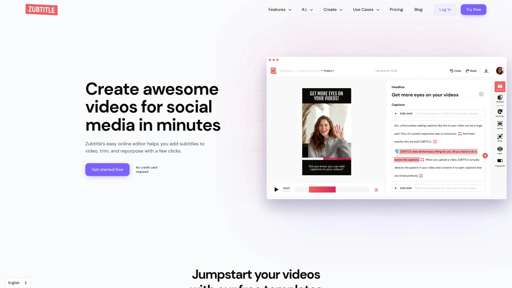

Zubtitle handles the heavy lifting of transcription automatically, converting spoken words to text captions without manual typing. The platform emphasizes simplicity over advanced features, making it accessible for creators needing basic subtitle functionality without complexity. Straightforward editing tools allow caption timing adjustments and text corrections within an uncomplicated interface. Zubtitle works well for creators prioritizing speed and ease of use over extensive customization options.

## **[OpusClip](https://opus.pro)**

AI video repurposing tool with automatic subtitle generation optimized for creating viral short clips from long-form content.

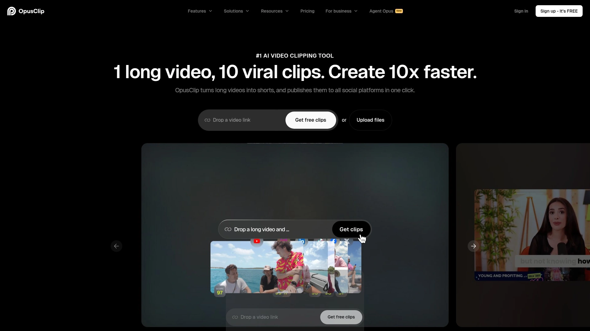

OpusClip specializes in extracting engaging short clips from longer videos with automatic subtitle generation included in the clipping workflow. Advanced speech recognition technology ensures precise subtitle accuracy for business presentations, educational videos, and podcasts. The automated system saves hours by handling both clip selection and subtitle generation simultaneously, letting creators focus on content rather than tedious editing tasks. Free subtitle generation with no credit card required makes testing the platform risk-free. Multi-language support and subtitle file exports in standard formats provide flexibility for various distribution needs. Stylish caption templates match trending social media aesthetics that drive engagement and viewer retention.

## **[AssemblyAI](https://www.assemblyai.com)**

Developer-focused Speech AI API providing transcription plus advanced audio intelligence features like sentiment analysis and entity detection.

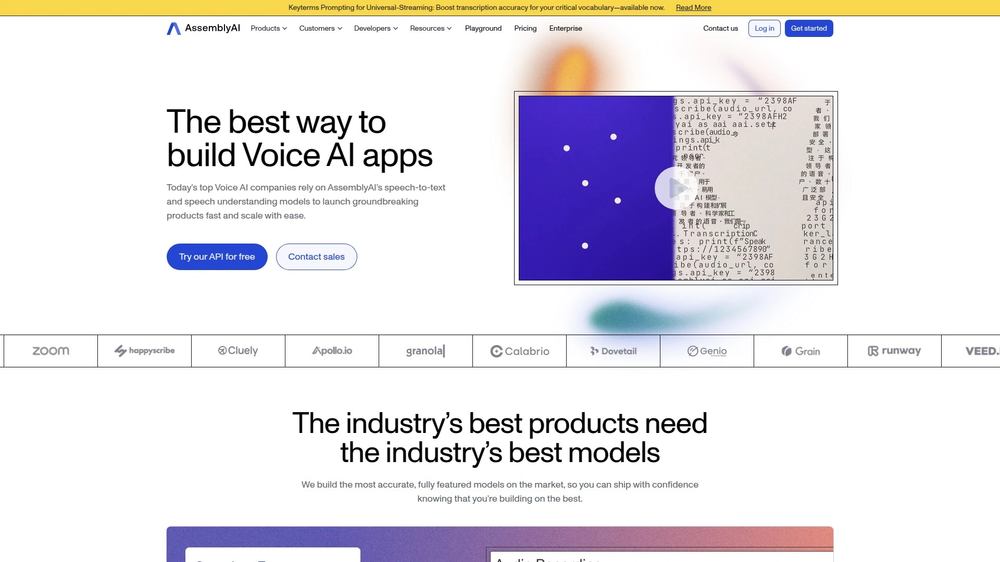

AssemblyAI delivers industry-leading accuracy through Universal models optimized for diverse audio conditions from noisy phone calls to studio recordings. The platform provides both batch processing for pre-recorded files and real-time streaming transcription maintaining ~300ms latency. LLM gateway framework applies large language models directly to speech data, enabling meeting summaries, action item extraction, and question answering without building separate AI infrastructure. Advanced speaker diarization identifies who said what in multi-person conversations with high separation accuracy. Entity detection automatically finds names, dates, and important information while PII redaction capabilities help maintain compliance. Developer experience prioritizes integration ease with comprehensive documentation and working code examples in multiple programming languages. Free credits for testing and development provide access to all features including streaming transcription and audio intelligence without monthly fees—you only pay for audio minutes processed.

## **[Deepgram](https://deepgram.com)**

Speech-to-text API with Nova-2 model specializing in real-time audio stream processing with ultra-low latency.

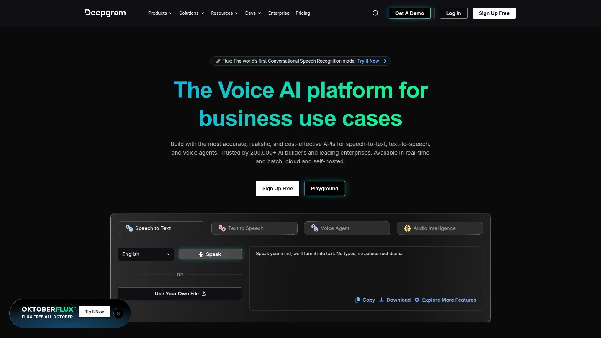

Deepgram processes audio streams with real-time factors around 0.2-0.3x, delivering transcripts with minimal delay suitable for live captioning and conversational AI applications. The Nova-2 model handles telephony audio, accents, and background noise effectively making it reliable for diverse real-world conditions. Streaming endpoints optimize specifically for real-time transcription needs rather than batch processing, maintaining consistent performance during live audio flows. API-first architecture with detailed documentation makes integration straightforward for developers building voice-enabled applications.

## **[Speechmatics](https://www.speechmatics.com)**

Verbatim transcription API supporting 50+ languages with disfluency tagging for complete conversation capture.

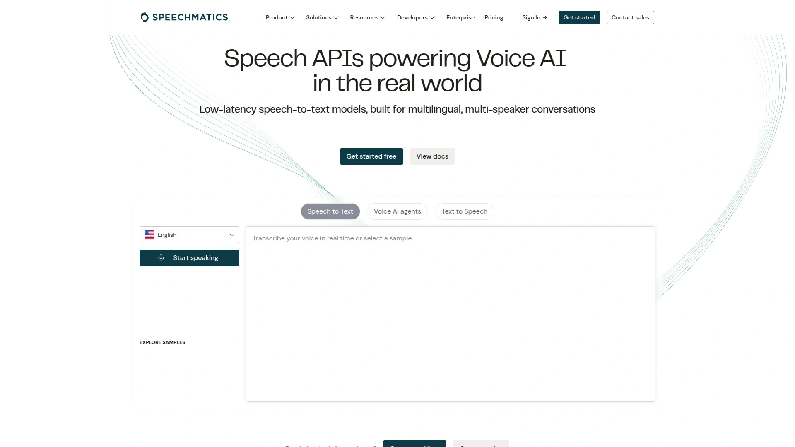

Speechmatics produces highly accurate verbatim transcripts including disfluencies tagged in output, capturing complete speech patterns rather than cleaned-up versions. Support for 50+ languages makes the platform suitable for international applications requiring multilingual transcription accuracy. Production-grade STT models deliver consistent performance for enterprise applications processing large transcript volumes. The platform emphasizes accuracy across languages and accents, making it reliable for global organizations.

## FAQ

**How accurate are AI transcription services compared to human transcription?**

Top AI transcription tools now reach 95-99% accuracy on clean audio with clear speech, making them suitable for most use cases including meetings, interviews, and content creation. Human transcription still wins for complex scenarios with heavy accents, multiple overlapping speakers, poor audio quality, or specialized terminology where context matters—professional transcribers deliver 99-100% accuracy but cost more and take longer. For everyday needs, AI transcription followed by quick human review provides the best balance of speed, cost, and accuracy.

**What's the difference between transcription and subtitle generation tools?**

Transcription converts spoken words into text documents for reading, searching, and documentation purposes, focusing on accuracy and speaker identification rather than visual display. Subtitle generation creates time-synced captions designed to appear on screen during video playback, emphasizing proper timing, readability, and formatting that matches platform requirements. Many modern platforms do both—transcribe first, then convert transcripts into properly timed subtitle files with styling options for burned-in captions or separate SRT/VTT files.

**Can transcription tools handle multiple speakers and languages in one recording?**

Most quality transcription platforms automatically identify and label different speakers through diarization technology, separating "Speaker 1" and "Speaker 2" without training. You can rename speakers during editing and changes apply throughout the transcript automatically. Language mixing within single recordings proves trickier—most tools transcribe in one primary language at a time, though some platforms support translation of finished transcripts into 40+ languages after initial transcription completes. For recordings genuinely mixing languages mid-conversation, professional human transcription handles complexity better than automated systems.

## Conclusion

Finding transcription software that actually delivers on promises comes down to matching features with your specific workflow—speed matters most for social media creators pumping out daily content, while accuracy takes priority for legal and research applications where every word counts. **[Happy Scribe](https://www.happyscribe.com/)** nails the flexibility factor with dual-mode operation letting you choose AI speed when deadlines loom or human precision when quality can't be compromised, all while supporting 120+ languages and offering collaborative editing tools that make team workflows effortless. Start with **[Happy Scribe](https://www.happyscribe.com/)** if you need reliable transcription that scales from quick meeting notes to professional subtitle creation—the combination of accuracy, language support, and both automated and human-reviewed options covers virtually every transcription scenario without forcing you to juggle multiple platforms.
